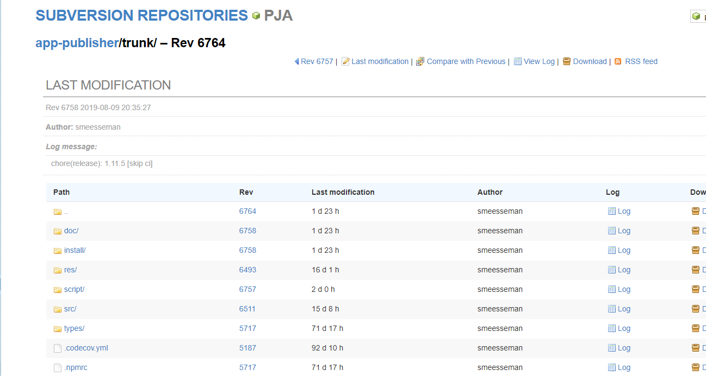
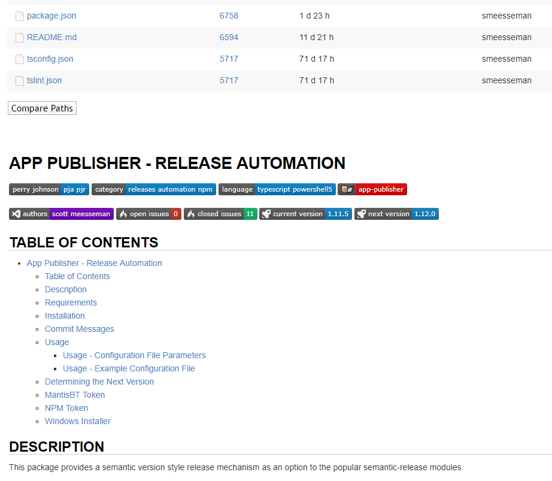
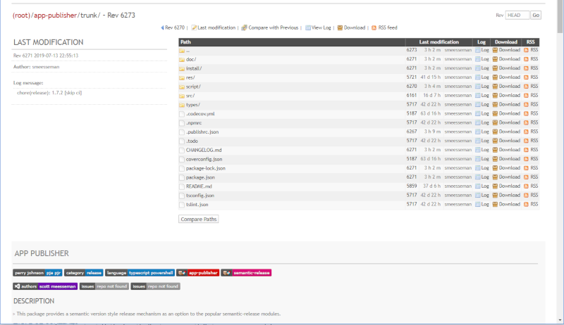

# WebSVN - Online subversion repository browser

This project is a fork of [websvnphp/websvn](https://github.com/websvnphp/websvn)

- [WebSVN - Online subversion repository browser](#WebSVN---Online-subversion-repository-browser)
  - [Description](#Description)
  - [Features](#Features)
  - [Screenshots](#Screenshots)

## Description

WebSVN offers a view onto your subversion repositories that's been designed to reflect the Subversion methodology.

## Features

This fork/branch has been updated with markdown support via [parsedown](https://github.com/erusev/parsedown) and [parsedown-toc](https://github.com/BenjaminHoegh/parsedown-toc), it will display the README file for any directory that has one, ala GitHub/VisualSVN.  A GitHub-ish theme has also been added, although not quite complete.

Base features:

- View the log of any file or directory and see a list of all the files changed, added or deleted in any given revision.
- View the differences between two versions of a file so as to see exactly what was changed in a particular revision.

## Screenshots

